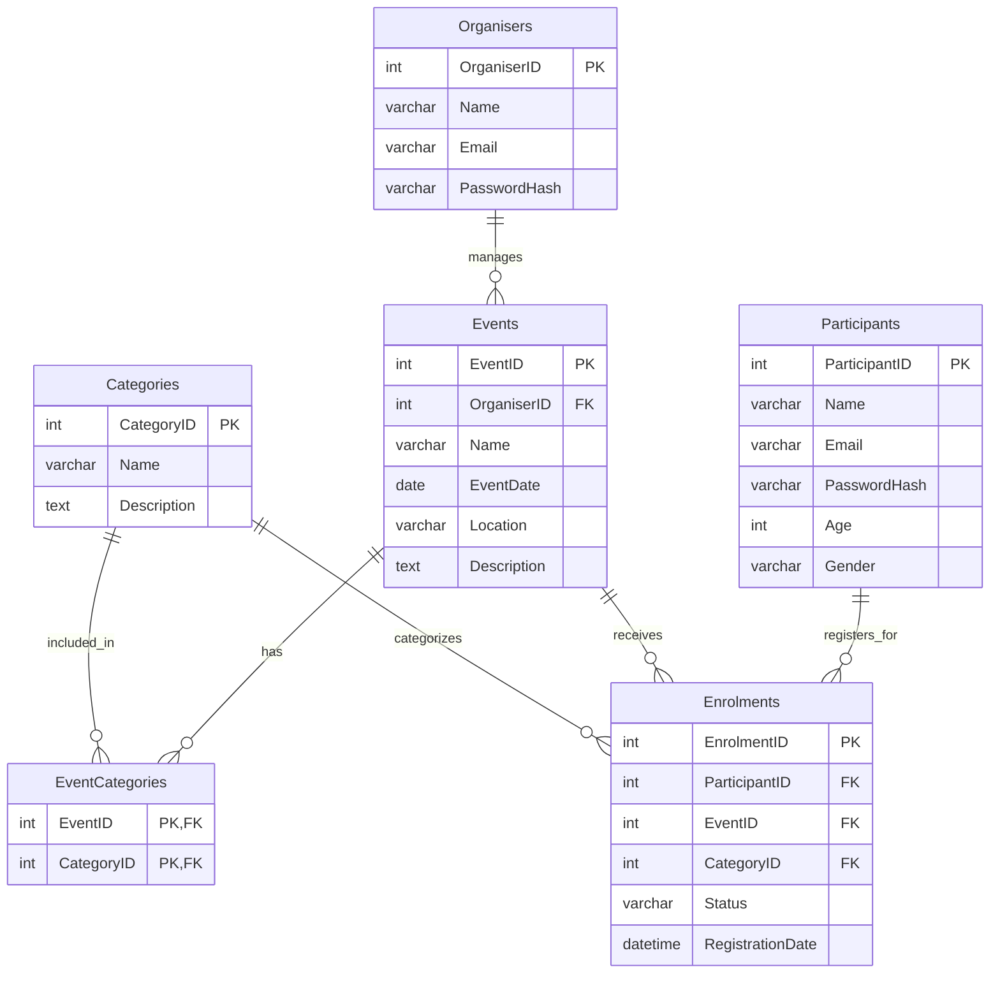

# Entity Relationship Diagram (ERD)

The ERD for the RaceDay system consists of 6 core entities:

```mermaid
erDiagram
    Organisers {
        int OrganiserID PK
        varchar Name
        varchar Email
        varchar PasswordHash
    }
    
    Participants {
        int ParticipantID PK
        varchar Name
        varchar Email
        varchar PasswordHash
        int Age
        varchar Gender
    }
    
    Events {
        int EventID PK
        int OrganiserID FK
        varchar Name
        date EventDate
        varchar Location
        text Description
    }
    
    Categories {
        int CategoryID PK
        varchar Name
        text Description
    }
    
    EventCategories {
        int EventID PK,FK
        int CategoryID PK,FK
    }
    
    Enrolments {
        int EnrolmentID PK
        int ParticipantID FK
        int EventID FK
        int CategoryID FK
        varchar Status
        datetime RegistrationDate
    }

    Organisers ||--o{ Events : "manages"
    Events ||--o{ EventCategories : "has"
    Categories ||--o{ EventCategories : "included_in"
    Participants ||--o{ Enrolments : "registers_for"
    Events ||--o{ Enrolments : "receives"
    Categories ||--o{ Enrolments : "categorizes"
```
